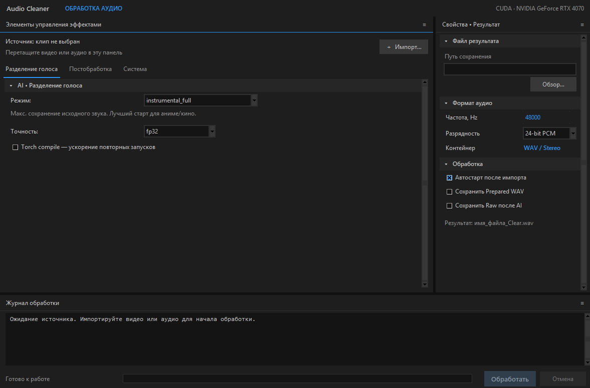

# Anime Audio Cleaner

Remove dialogue and vocals from anime, films, and audio files while preserving background music and effects. Processing runs locally and exports a stereo `*_Clear.wav` for editing. Standalone Windows app with a Premiere-inspired interface; GUI labels are in Russian.

## Installation

1. Install **Python 3.12 x64** and enable **Add Python to PATH**.
2. Download this repository using **Code → Download ZIP**, then extract it into a writable folder.
3. Run **`start.bat`** and wait for setup. On first launch, it downloads and verifies **FFmpeg + FFprobe**, creates the Python environment, and installs the AI dependencies. No manual FFmpeg installation or system PATH changes are needed on Windows.
4. Import a video/audio file and select an audio track if prompted. **Auto-start is enabled by default**; disable it before importing if you want to adjust settings first.
5. Find the resulting WAV beside your source, or choose another output location.

An internet connection is required for setup and model downloads. Models are cached for later runs. If installation fails, check the console message and rerun `start.bat`. Use `repair.bat` to reinstall dependencies and the local FFmpeg tools.

## Profiles

### Voice separation

| Preset | Purpose |
| --- | --- |
| `instrumental_full` | Default: prioritize preservation of music and sound effects. |
| `instrumental_balanced` | Balance background preservation and voice removal. |
| `instrumental_clean` | More aggressive voice removal; higher risk of artifacts. |
| `instrumental_low_resource` | Lower-resource alternative with a quality tradeoff. |
| `karaoke` | Lead singing vocals rather than dialogue. |
| `vocal_*` | Alternative vocal-oriented ensembles; the app exports their instrumental stem. |

### Post-processing

| Profile | Purpose |
| --- | --- |
| `off` | No cleanup effects; output format conversion still applies. |
| `safe` | Default: 20 Hz high-pass, automatic denoising, and loudness normalization. |
| `restoration` | Cleanup with a quiet blend of original high frequencies; may bring back voice remnants. |
| `custom` | Adjust individual effects manually. |

Default export: **48 kHz / 24-bit PCM WAV**, with a **-18 LUFS** target in the safe profile. Separation is imperfect: some voices may remain and some effects may be affected.

## Dependencies

- **Required beforehand:** Windows x64, Python 3.12 with Tkinter, internet for setup.
- **Installed automatically:** FFmpeg/FFprobe, PyTorch, `audio-separator 0.47.0`, ONNX Runtime, NumPy, SoundFile, Librosa, Audioread, and TkinterDnD2.
- **GPU acceleration:** optional NVIDIA GPU and a driver compatible with the CUDA 13.0 PyTorch build. Otherwise setup uses the CPU dependency path.
- Leave space for dependencies, model weights, temporary WAV files, and exports. Storage needs vary by model and episode length.

### macOS (experimental)

Install **Python 3.12 with Tkinter** from python.org and **Homebrew** from brew.sh, then extract the project and open `start.command`. Missing FFmpeg/FFprobe are installed through Homebrew automatically. `repair.command` rebuilds the Python environment while keeping settings and cached models. Close the app before running repair.

If the ZIP download lost executable permissions, run `chmod +x start.command repair.command` in the project folder. These scripts have not been tested on a Mac; macOS uses the CPU dependency path.

## Tested configuration

**Windows 11 · RTX 4070 12 GB · 32 GB RAM · NVIDIA driver 616.92**

A **23 min 40 sec** episode processed in **8 min 53 sec** using `instrumental_clean`, FP32, and safe post-processing:

- Peak total GPU memory: **6.31 GiB**, including background applications; **2.45 GiB** was already occupied before processing.
- Peak combined process RAM (RSS): **4.92 GiB**.

These measurements are not verified minimum requirements. RTX 3050 and lower-memory systems have not been tested. CPU processing is supported but has not been benchmarked here.

---

If this project helps you, please give it a **⭐ on GitHub**!

**Demo and discussion on Telegram:** [t.me/unpecador/20](https://t.me/unpecador/20)
